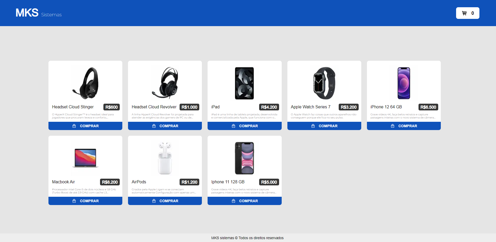

<h1 align="center">
    Eletronics store
</h1>

<h3 align="center">
    Loja de Eletrônicos
</h3>

<p align="center">
  

  
  
  <a href="https://github.com/Veronezegui/MKS-Front-end-challenge/commits/main">
    
  </a>
    
   
  
  
</p>

<h4 align="center">
	🚧   Concluído 🚀 🚧
</h4>

## 💻 Sobre o projeto

Eletronics store - é uma aplicação desenvolvida em React.js com Next.js,Typescript e styled-components que consome uma rest API de produtos eletrônicos. Trata-se de uma página que lista todos os produtos da API através de cards, dando a opção ao usuário de escolher quais produtos deseja comprar, ao pressionar o botão "comprar" de qualquer produto, o mesmo será acrescentado ao carrinho, no qual o usuário pode selecionar a quantidade de cada item e conferir o valor total de sua compra, além de poder remover qualquer produto já adicionado.

---


## ⚙️ Funcionalidades

- [x] Skeleton enquanto a chamada a api está em loading.
- [x] Tela com a listagem dos produtos contidos na API.
- [x] Botão comprar em cada produto listado, com a função de adicionar os produtos selecionados ao carrinho.
- [x] Botão com a função de exibir o carrinho de compras, exibe a quantidade de produtos selecionados.
- [x] Carrinho que exibe todos os produtos selecionados com a opção de aumentar ou diminuir a quantidade deles, o total e o botão para finalizar a compra.

---

## 🎨 Layout

<p align="center">

  

</p>

---


## 🚀 Como executar o projeto

## Pré-requisitos

Antes de começar, você vai precisar ter instalado em sua máquina as seguintes ferramentas:
[Git](https://git-scm.com), [Node](https://nodejs.org/). 
Além disto é bom ter um editor para trabalhar com o código como o [VSCode](https://code.visualstudio.com/).

#### 🎲 Clonando o repositório e instalando as dependências

```bash

# Clone este repositório
$ git clone https://github.com/Veronezegui/MKS-Front-end-challenge.git

# Instale as dependências web
$ npm install

# Execute a aplicação em modo de desenvolvimento
$ npm run dev

# O servidor inciará na porta:3000 - acesse http://localhost:3000

```

## 🦸 Autor


 <br />
 <sub><b>Guilherme Veroneze</b></sub></a> 🚀
 <br />


---

## 📝 Licença

Este projeto está sob a licença [MIT](./LICENSE).

Feito com muita dedicação por Guilherme Veroneze 👋🏽 [Entre em contato!](https://github.com/Veronezegui)

---
